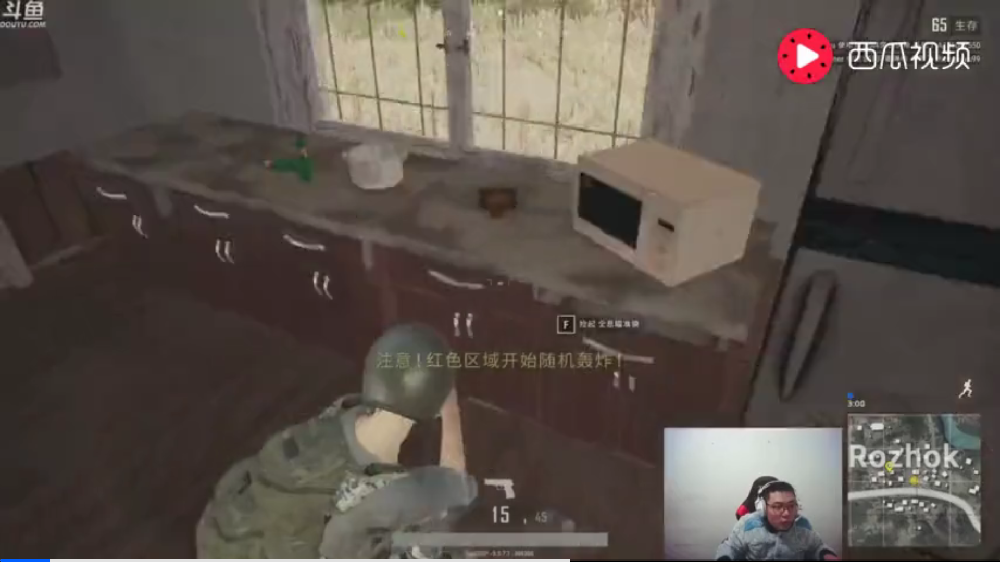
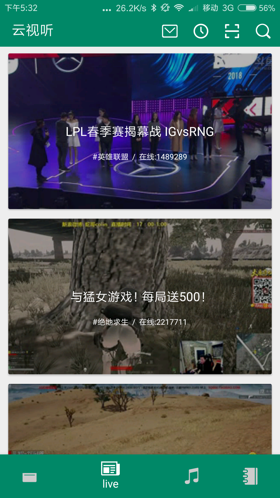
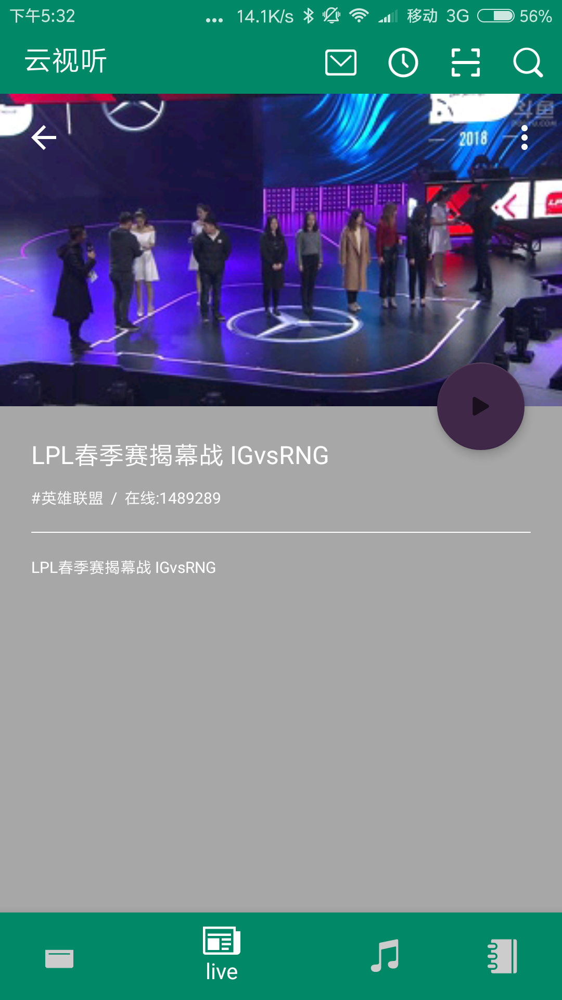
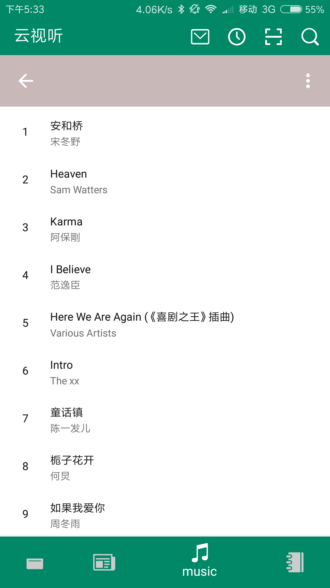
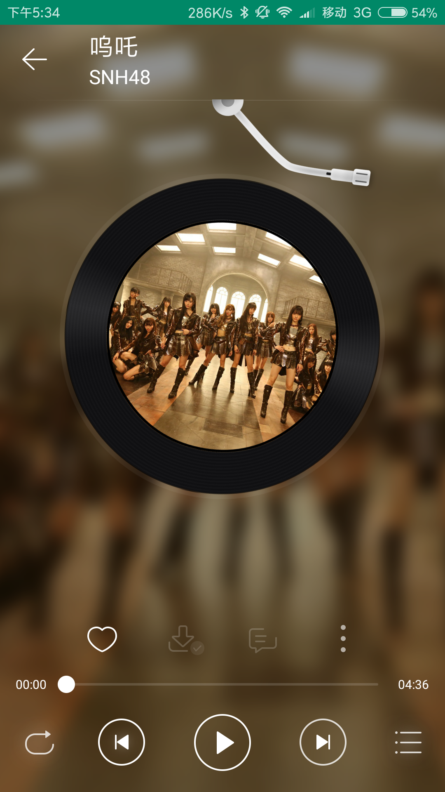
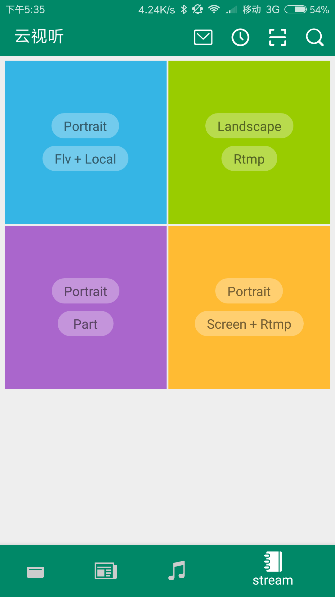

# CloudPlayer

 

## keywords

bilibili、videoplayer、musicplayer、vrlib、Stream、framework、MediaPlayer、MediaRecorder、AudioRecorder、MediaExtractor、MediaSync、MediaMuxer、AudioTrack、MediaCodec、StagefrightPlayer、StagefrightRecoder、AwesomePlayer、NuPlayer、OpenMax、OMX、OpenCore、SurfaceFinger、AudioFinger、FFmpeg、FFplay、RTSP、HLS、RTMP、封装格式、TS、RMVB、FLV、MP4、H.264、HEVC、VP9、MPEG2/4、AAC、MP3、AC-3、YUV420P、RGB、PCM、码率、帧、采样率、Camera、CameraService
## Screenshots

  

  

  

## Thanks to the open source project

* [RxJava](https://github.com/ReactiveX/RxJava)
* [RxAndroid](https://github.com/ReactiveX/RxAndroid)
* [RxBinding](https://github.com/JakeWharton/RxBinding)
* [RxLifecycle](https://github.com/trello/RxLifecycle)
* [okhttp](https://github.com/square/okhttp)
* [retrofit](https://github.com/square/retrofit)
* [ijkplayer](https://github.com/Bilibili/ijkplayer)
* [DanmakuFlameMaster](https://github.com/Bilibili/DanmakuFlameMaster)
* [butterknife](https://github.com/JakeWharton/butterknife)
* [glide](https://github.com/bumptech/glide)
* [MaterialSearchView](https://github.com/MiguelCatalan/MaterialSearchView)
* [FlycoTabLayout](https://github.com/H07000223/FlycoTabLayout)
* [MagicaSakura](https://github.com/Bilibili/MagicaSakura)
* [FlowLayout](https://github.com/hongyangAndroid/FlowLayout)

## Statement

The project only for the use of exchange of learning, such as the project have bilibili copyright infringement problem, I will delete this page and the whole project in time.

## License

DO WHAT THE FUCK YOU WANT TO PUBLIC LICENSE

Everyone is permitted to copy and distribute verbatim or modified
copies of this license document, and changing it is allowed as long
as the name is changed.

DO WHAT THE FUCK YOU WANT TO PUBLIC LICENSE
TERMS AND CONDITIONS FOR COPYING, DISTRIBUTION AND MODIFICATION

You just DO WHAT THE FUCK YOU WANT TO.

